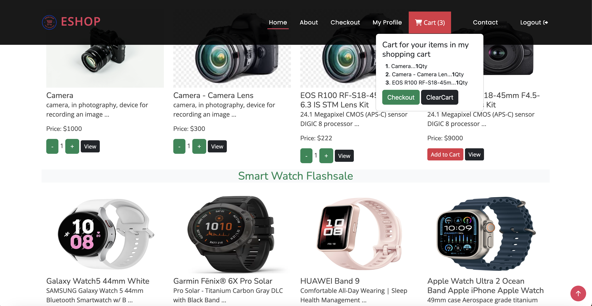

# Ecommerce_Django
Ecommerce is project for student assignment using django (Python)

# Install docker in Window 11

To install Docker in Windows 11, you can follow these steps:

    1. Go to the Docker website (https://www.docker.com/products/docker-desktop) and download Docker Desktop for Windows.

    2. Run the installer and follow the on-screen instructions to complete the installation.

    3. Once the installation is complete, Docker Desktop will be running in the background.

    4. You can verify the installation by opening a command prompt or PowerShell window and running the following command:

        ```
        docker --version
        ```

        If Docker is installed correctly, you should see the version number displayed.

    5. You can now use Docker to run containers and manage your development environment.

To install Docker in Mac, you can follow these steps:

1. Go to the Docker website (https://www.docker.com/products/docker-desktop) and download Docker Desktop for Mac.
2. Run the installer and follow the on-screen instructions to complete the installation.
3. Once the installation is complete, Docker Desktop will be running in the background.
4. You can verify the installation by opening a terminal window and running the following command:

    ```
    docker --version
    ```
    If Docker is installed correctly, you should see the version number displayed.
5. You can now use Docker to run containers and manage your development environment.

# Build Image (Docker Compose)
docker-compose build

# Run Image
docker-compose up


